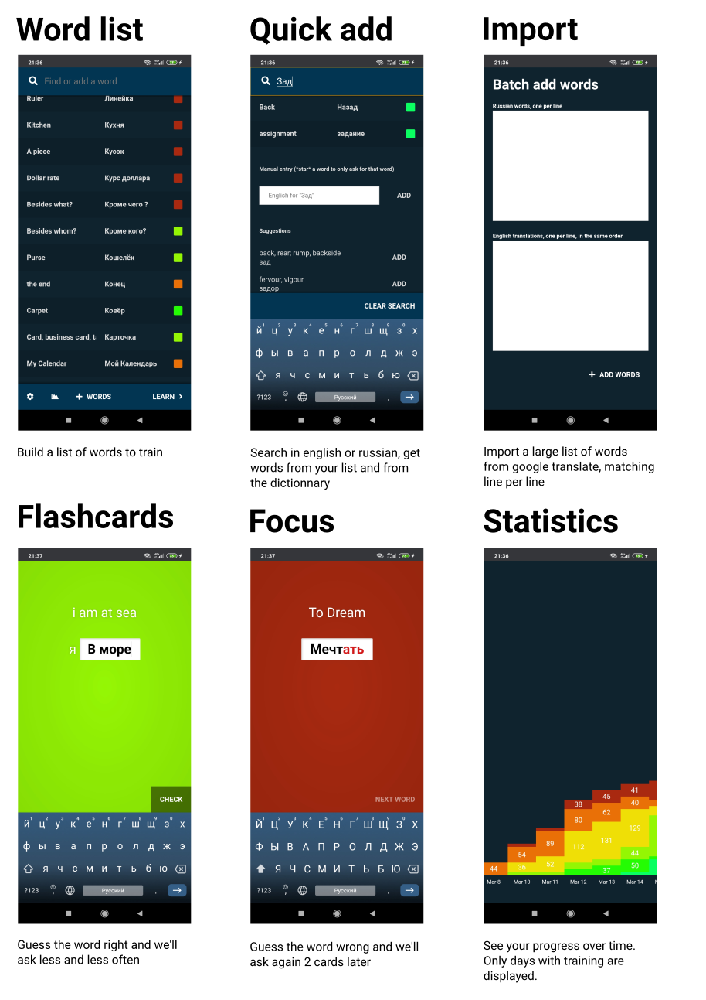

# Simple, free and ads free russian vocabulary trainer

For students having russian classes that need to learn specific vocabulary over time.

All the critical features should be available offline and with only
the static files. Additional features (smarter suggestions, self
improving word list ..) can rely on a cheap heroku instance.

The app only targets phones because it's much easier to get a
cyrillic keyboard there. It should work on iOS and android.

[Use it here on a mobile phone](https://mywords.netlify.app)



## Technical details

- Based on [Preact CLI](https://github.com/developit/preact-cli/blob/master/README.md).

- Dictionnary search happens in a web worker, it's slow but doesn't block the main thread

- We use a virtual table to show the words list

- The TTS is delegated to the browser, seems to work fine in firefox
  and chrome on android.

## Development setup

```bash
npm install

# serve with hot reload at localhost:8080
npm start

```
