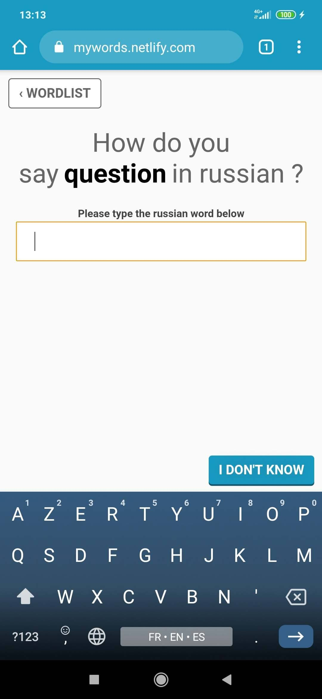

# My words

This is a simple words learning app made because I was frustrated by the current 
offering.




It's meant to be free and ad free, and to stay simple.

## Development

This is base on [Preact CLI](https://github.com/developit/preact-cli/blob/master/README.md).

``` bash
npm install

# serve with hot reload at localhost:8080
npm start

```
